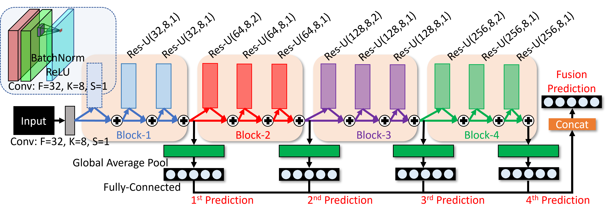
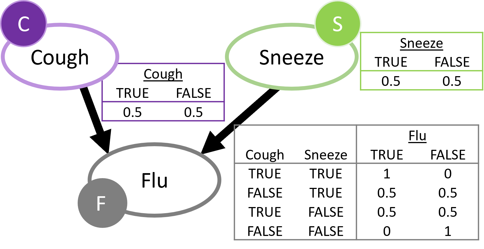

# Flu Detection Decision Support

Script provided is in relation with the following paper:

- K. Lai and S. Yanushkevich, [Decision Support for Video-based Detection of Flu Symptoms](https://ieeexplore.ieee.org/document/9283273), IEEE International Conference on Systems, Man, and Cybernetics, October 2020, pp. 1-7. 

Architure used in the paper is as follows:



The Res-TCN network is composed of four block of residual units. Each residual unit is composed of three sets of sub-blocks where each sub-block is the combination of Batch Normalization (BatchNorm), Rectified Linear Unit (ReLu), and Convolution layers. The sub-block structure is illustrated in the Figure above. Res-U(32, 8, 1) represents a sub-block containing a convolutional layer with 32 filters (F = 32), filter size of 8 (K = 8), and stride of 1 (S = 1)

Simple Causal Network:

Assume cough and sneeze are symptoms of flu.

## Dataset
The experiment in this paper is based on the [BII Sneeze-Cough Human Action Video Dataset](https://web.bii.a-star.edu.sg/~chengli/FluRecognition.htm):
 
*T. H. Thi, L. Wang, N. Ye, J. Zhang, S. Maurer-Stroh, and L. Cheng, “Recognizing flu-like symptoms from videos,” BMC Bioinformatics, vol. 15, no. 1, p. 300, 2014.*

## Setup
Libraries:
- numpy 1.18.1
- keras 2.2.4
- tensorflow 1.13.1
- scipy 1.2.1
- pillow 5.4.1
- opencv 3.4.1
- opencv-python 4.2.0.32

Extraction of body joints via use of HR-Net (https://github.com/stefanopini/simple-HRNet).

## Usage
Run action recognition using images
```
python3 run.py
```

Run action recognition using extracted features, cross-validation via group of subjects.
```
python3 run-a.py
```

Run action recognition using extracted features, cross-validation via gender.
```
python3 run-g.py
```

Run action recognition using extracted features, cross-validation via pose.
```
python3 run-p.py
```

Run action recognition using extracted features, cross-validation via view.
```
python3 run-v.py
```