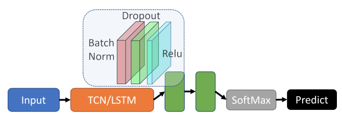

# Gesture Classification

Script provided is in relation with the following papers:
- R. Islam, K Lai and S. Yanushkevich, [Hand Gesture Classification on Praxis Dataset: Trading Accuracy for Expense](https://ieeexplore.ieee.org/document/9892631), 2022 International Joint Conference on Neural Networks (IJCNN), 1-8

Model Network:



General architecture for our multi-class classification model.
 
## Dataset
The experiment in this paper is based on the [Praxis Dataset](https://team.inria.fr/stars/en/praxis-dataset/).

## Setup
Libraries:
- numpy 1.18.1
- opencv 3.4.1
- opencv-python 4.2.0.32

## Usage
Initiate gesture training:
```
python3 test_multi.py
```
