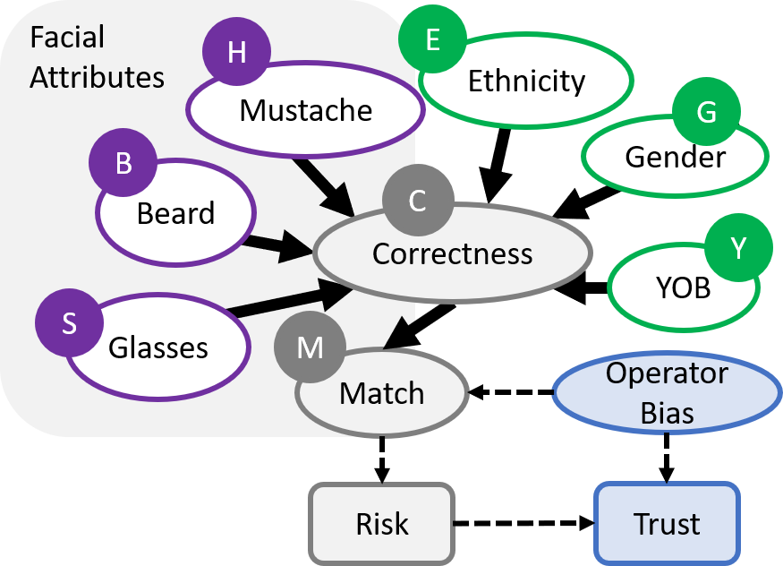

# Risk, Trust, and Bias

Script provided is in relation with the following papers:

- K. Lai, H. Oliveira, M. Hou, S. Yanushkevich, and V. Shmerko, [Assessing Risks of Biases in Cognitive Decision Support Systems](https://ieeexplore.ieee.org/document/9287384), European Signal Processing Conference, January 2021, pp. 840-844

- K. Lai, H. Oliveira, M. Hou, S. Yanushkevich, and V. Shmerko, [Risk, Trust, and Bias: Causal Regulators of Biometric-Enabled Decision Support](https://ieeexplore.ieee.org/document/9164930), IEEE Access, vol. 8, August 2020, pp. 148779-148792.

Causal Network:

Using Bayesian network to model how biases can impact a dataset.  Each parent node is created based on the different attributes: facial attributes, ethnicity, gender, and year-of-birth.
 
## Dataset
The experiment in this paper is based on the [FERET Dataset](https://www.nist.gov/itl/products-and-services/color-feret-database).

## Setup
Libraries:
- numpy 1.18.1
- opencv 3.4.1
- opencv-python 4.2.0.32

Requires additional installation of vggface for face recognition.

- [keras_vggface](https://github.com/rcmalli/keras-vggface/tree/master/keras_vggface)

## Usage
Initiate face recognition on FERET dataset:
```
python3 rec.py
```

Analyze results
```
python3 result.py
```

