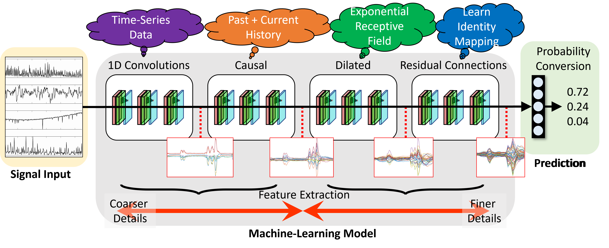
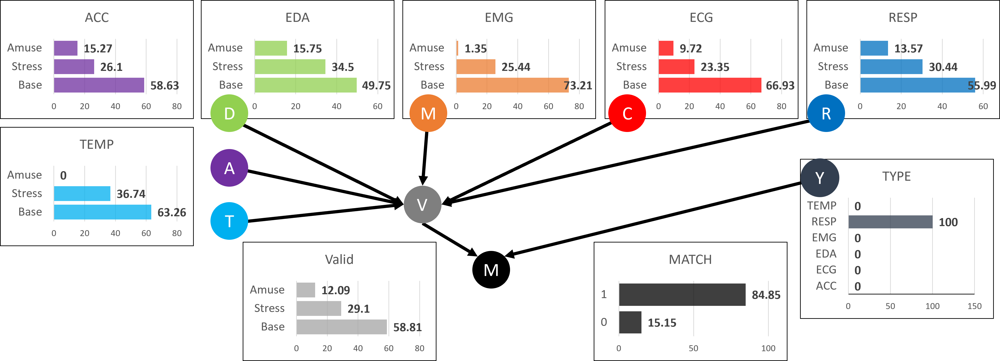

# Intelligent Stress Monitoring Assistant

Script provided is in relation with the following paper:

- K. Lai, S. N. Yanushkevich and V. P. Shmerko, [Intelligent Stress Monitoring Assistant for First Responders](https://ieeexplore.ieee.org/document/9348878), in IEEE Access, vol. 9, February 2021, pp. 25314-25329.

Architure used in the paper is as follows:




Bayesian Network:



## Dataset
The experiment in this paper is based on the [WESAD Dataset](https://archive.ics.uci.edu/ml/datasets/WESAD+%28Wearable+Stress+and+Affect+Detection%29). A description of the dataset can be found in:

*P. Schmidt, A. Reiss, R. Duerichen, C. Marberger, and K. Van Laerhoven, “Introducing wesad, a multimodal dataset for wearable stress and affect detection,” Proc. of the Int. Conf. on Multimodal Interaction, pp. 400–408, 2018.*

## Setup
Libraries:
- numpy 1.18.1
- keras 2.2.4
- tensorflow 1.13.1
- scipy 1.2.1
- pillow 5.4.1
- opencv 3.4.1
- opencv-python 4.2.0.32

## Usage
To run with default parameters for multi-class emotion recognition:
```
python3 run.py
```

or custom parameters for multi-class emotion recognition:
```
python3 run.py --timestep=240 --step=1 --cv=0 --cycle=1
```
Timestep is the number frames to be used, step is the number of frames to skip for next sequence, cv is the fold used for cross-validation, and cycle is the number of times to restart cycle based on Cosine annealing.

Analyze results:
```
python3 analyze.py
```
